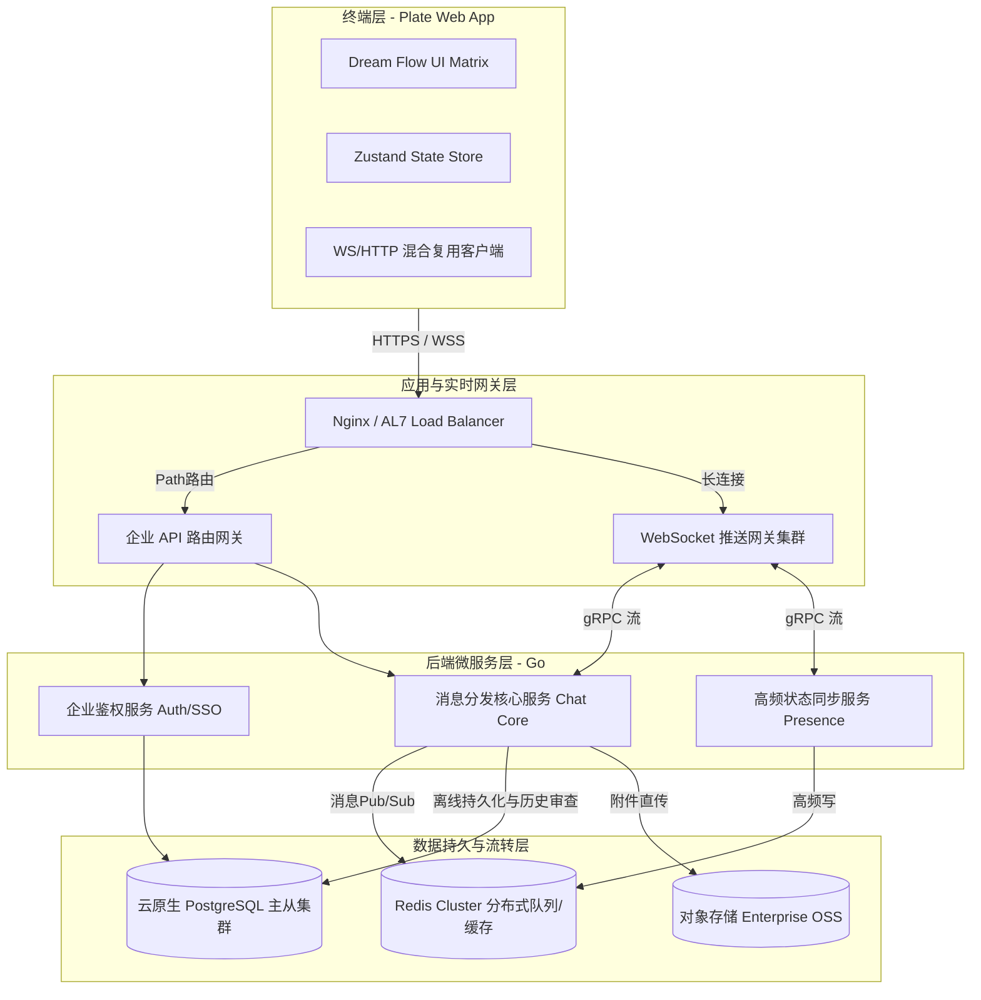
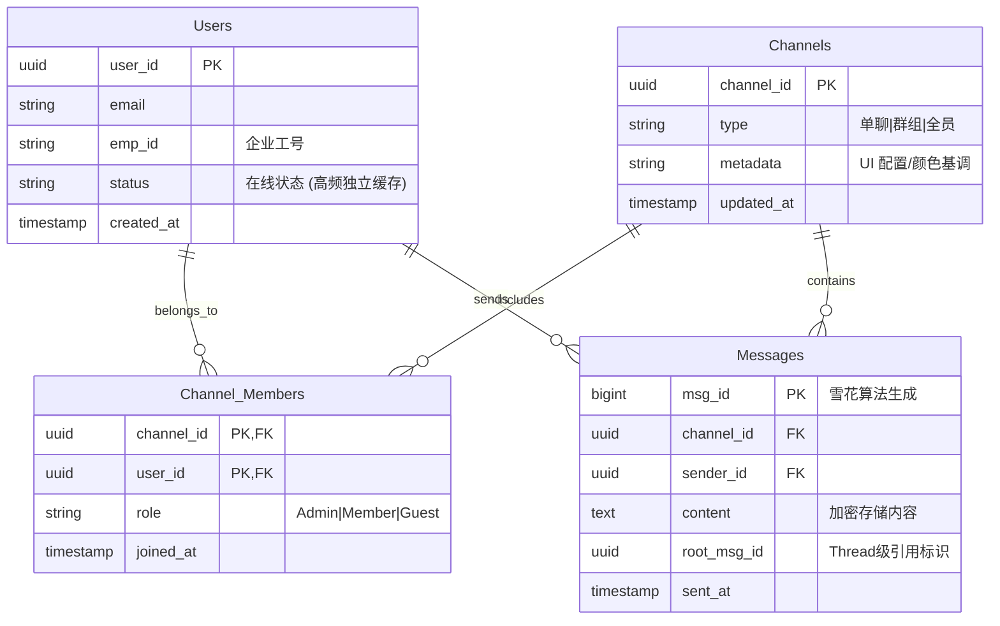

# Plate 平台 - 第一阶段 (MVP) 企业级架构与设计文档

**文档版本**: v1.0.0
**项目代号**: Plate
**文档状态**: Approved (Draft / Review / Approved)
**目标受众**: 架构师、全栈研发工程师、运维安全团队、产品评审委员会

---

## 1. 执行摘要 (Executive Summary)

本设计文档详述了 Plate 平台第一阶段 (Phase 1 MVP) 的系统设计。本系统旨在解决大型企业（世界五百强级别）内部跨部门沟通中面临的信息碎片化、知识难沉淀的问题。Phase 1 作为承载后续“AI 结晶”模块的基石，主要目标是构建一个具备**高可用、高并发、极端流畅体验 (Dream Flow Aesthetic)** 且合乎企业级安全与审计标准的实时通信底座。

---

## 2. 第一阶段范围定义 (Scope & Boundaries)

遵循企业级项目的精益实施标准，对 Phase 1 阶段设定严格的边界控制。

### 2.1 包含在内 (In-Scope)
*   **企业级身份认证**：继承基础的企业单点登录 (SSO / OAuth2) 标准接口设计。
*   **核心实时通信**：无延迟的 P2P 单聊、多人群聊 (Channel)、以及消息的 Thread (主题) 追溯。
*   **Dream Flow UI 基础层**：基于 Next.js 15 和 Framer Motion 实现毛玻璃材质、流体阻尼切换等高性能前端渲染引擎。
*   **富媒体传输支持**：多语言代码高亮预览、办公文件传输通道的建立。
*   **高可用集群架构**：双节点或多节点 WebSocket 负载均衡，Redis 分布式消息队列订阅分发机制。

### 2.2 暂不包含 (Out-of-Scope) - *预留至 Phase 2 ~ Phase 4*
*   Markdown 双向链接编辑器与 Obsidian 式图谱 (Phase 2)
*   基于向量数据库的 AI 自动摘要生成和长程内容检索 (Phase 3)
*   防泄漏 RAG 工程架构与深度因果推断平台预警系统 (Phase 4)

---

## 3. 企业级系统架构剖析 (Enterprise System Architecture)

本阶段采用微服务架构模式，实现前端展现、实时网关、业务核心与数据的深度解耦，从而轻易应对过万级别的内部并发协同请求。

### 3.1 总体组件拓扑视图 (High-Level Topology)

### 3.2 表现层架构设计 (Next.js 15 SSR / CSR 混排)
由于 Plate 要求极高的流畅性：
1.  **Server Components (RSC)**：用于首屏极速加载聊天目录、组织架构树以及历史配置。以此减轻客户端 JS 绑定负担。
2.  **Client Components**：针对复杂的 `Dream Flow` 会话框流体拖拽、弹起动画，结合 Framer Motion 在客户端侧独立接管 DOM 树运算。
3.  **状态管理 (State Management)**：对海量消息列表废弃复杂的 Redux，采用更轻量级的 `Zustand` 结合 `Immer.js` 实现防内存泄漏和 O(1) 级别的不可变数据更新。

### 3.3 实时核心 (Go WebSocket 集群)
*   **网关无状态化 (Stateless Gateway)**：多台 WebSocket 节点本身不储存业务逻辑，只维护 Socket FD（文件描述符）。
*   **Redis Pub/Sub 回环通道**：某个实例接受消息后，往 Redis 的指定 Channel 发布。负责对应用户长连接的特定 WS 节点侦听该 Channel 完成投递，解决分布式跨服消息发送难题。

---

## 4. 核心数据字典与模型 (Data Architecture)

核心关注强一致性以及海量消息数据的水平扩展能力（分表或分区表准备）。

*(注：`Messages` 表将按照企业规范做按月时间范围分区 (Table Partitioning) 归档，提升查询检索效率。)*

---

## 5. NFR：非功能性与企业标准合规 (Non-Functional Requirements)

为了达到真正的世界五百强可用性底线，必须贯彻以下指标：

### 5.1 服务等级协议 (SLA) 与性能指标
*   **端到端延迟 (E2E Latency)**：99th 百分位在同机房网络环境下 < `50ms`，异地访问 < `200ms`。
*   **可用性保障 (Availability)**：微服务体系必须提供 `99.99%` (四个九) 运行期保证，支持可用区维度的多活容灾。
*   **连接并发压力 (Concurrency)**：Phase 1 至少支持单节点承载 100,000 WebSocket 并发长链接，不发生阻塞宕机。

### 5.2 安全与审计体系 (Security & Auditing)
遵循企业**零信任 (Zero Trust) 架构**网络规范：
*   所有业务数据下沉数据库前进行 **AES-256-GCM** 行级加密落盘，防范脱库。
*   采用企业级双端证书 (mTLS) 鉴权，或使用严格防重放攻击的 JWT (有效期短，配合 Refresh Token 黑名单机制)。
*   满足企业审计需求：每一次文件操作、历史记录删除等动作必须在独立的 `Audit_Log` 服务留档，且只允追加不允许修改（WORM）。

### 5.3 监控可观测性 (Observability)
*   接入 Prometheus + Grafana 实现对 CPU / 内存泄露 / WebSocket GC 延时的全覆盖预警（Alertmanager 电话/邮件通知）。
*   全面接入 OpenTelemetry，为每一条 Request 分配唯一 `TraceID` 追踪整个分布式请求链路。

---

## 6. Phase 1 交付流程与 DevOps 规划

为保持快速平稳交付，确立工程基础自动化流水线（CI/CD）：

1.  **Code Review & Lint**：GitLab/GitHub 必须配有 SonarQube 进行代码坏味道审查、及 Next.js 的 ESLint / TSC 强校验。
2.  **自动化测试**：
    *   **Unit Tests**: 前端使用 `Jest` / 后端使用 `Go test`，要求 80%+ 覆盖率。
    *   **E2E Tests**: 使用 `Playwright` 模拟内部员工的大促压力/聊天体验。
3.  **容器化镜像**：将 Go 编译为极其微小 (`~20MB`) 的 `Scratch` 镜像。将 Next.js 编译为独立 `Standalone` 减小 Node.js 镜像体积。
4.  **蓝绿 / 金丝雀发布**：基于 Kubernetes 部署，业务升级实现 `0-Downtime` （业务零中断）。

> 阶段性结语 (Conclusion for Phase 1 Design)
> 第一阶段的基石架构必须**克制且坚固**。不引入花哨的特性，而是通过扎实的雪花主键发号器、安全的连接网关、和精美的组件化 UI (Dream Flow)，去夯实这栋摩天大楼的地基。只有当数据流在 Phase 1 以绝对可靠和快速的方式无损沉淀下来，后续 Phase 2 - 4 基于 AI 的“记忆网络结晶”才能发挥威力。
